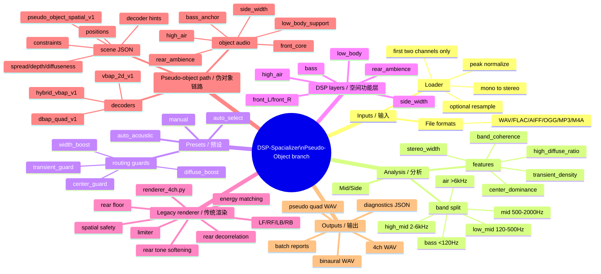

# Streaming Stereo Spatializer / DSP Spatializer 使用说明（Pseudo-Object 分支）

> **Branch notice / 分支说明 — `Pseudo-Object` experimental branch / 实验分支**
>
> **EN:** This README describes the `Pseudo-Object` branch, not repository `main`.
> `main` is the legacy fixed 4.0 channel-renderer line.
> This branch keeps the legacy path working while adding pseudo-object scene metadata,
> pseudo-object layer audio export, and modular layout-driven decoders.
>
> **中文：** 本 README 描述的是 `Pseudo-Object` 分支，不是仓库的 `main` 分支。`main` 应视为 legacy fixed 4.0 channel renderer 主线。本分支在保留 legacy 路径可用的基础上，新增 pseudo-object scene metadata、pseudo-object layer audio 导出，以及面向 speaker layout 实验的模块化 pseudo-object decoder。
>
> **Important / 重要：** Pseudo objects are **spatial-function objects** derived from DSP layers. They are not clean stems, not source-separated instruments, and not claims of real object audio.
>
> **重要：** pseudo object 是由 DSP 空间功能层派生出的 **spatial-function object**。它不是 clean stem，不是 AI 分离得到的乐器/人声 stem，也不代表真正的 object audio。

## Main vs Pseudo-Object / `main` 与 `Pseudo-Object` 分支对照

| Area / 项目 | `main` branch / 主分支 | `Pseudo-Object` branch / 本分支 |
| --- | --- | --- |
| Primary path / 主链路 | Stereo → DSP layers → fixed `renderer_4ch.py` | Same legacy path, plus pseudo-object scene path / 保留 legacy 链路，并新增 pseudo-object scene 链路 |
| Metadata / 元数据 | Diagnostics-focused JSON / 以 diagnostics JSON 为主 | Adds `pseudo_object_spatial_v1` scene metadata / 新增 pseudo-object scene metadata |
| Object audio / 对象音频 | Not exported as object layers / 不导出 object layer audio | Exports DSP layer material under `*_objects/` / 在 `*_objects/` 下导出 DSP layer material，但不是 clean stem |
| Decoding / 解码 | Fixed 4.0 renderer / 固定四声道渲染 | DBAP fallback, 2D VBAP, hybrid spread-VBAP / 支持 DBAP fallback、2D VBAP、hybrid spread-VBAP |
| CLI additions / CLI 增量 | Legacy output options / legacy 输出参数 | Adds `--export-pseudo-scene`, `--decode-pseudo-scene`, `--pseudo-scene-only`, `--pseudo-renderer` |
| Intended use / 用途 | Stable 4.0 / binaural upmix / 稳定 fixed-channel 4.0 / binaural upmix | Experimental pseudo-object architecture and decoder research / pseudo-object 架构与 decoder 实验研究 |

**EN:** If you want the original stable fixed-channel behavior, use `main` or run this branch without pseudo-object flags. If you want pseudo-object scene export, layout-driven decoding, or VBAP renderer experiments, use the `Pseudo-Object` branch.

**中文：** 如果只需要原来的稳定 fixed-channel 4.0 / binaural 行为，请使用 `main`，或者在本分支不加 pseudo-object 相关参数运行。若需要导出 pseudo-object scene、尝试 layout-driven decoder，或进行 VBAP / hybrid renderer 实验，请使用 `Pseudo-Object` 分支。

## Quick Reference / 快速说明

**EN:** This branch does not split stereo audio into real instrument objects.
Instead, it describes the existing DSP layers (`bass`, `front_core`, `side_width`,
`rear_ambience`, `high_air`, and `low_body_support`) as interpretable
spatial-function pseudo objects. The scene JSON can be consumed by different
decoders. The current default layout is `default_quad_4p0`, and three pseudo
renderers are provided.

**中文：** 本分支不是把 stereo 分成真实乐器对象，而是把现有 DSP layer，例如 `bass`、`front_core`、`side_width`、`rear_ambience`、`high_air`、`low_body_support`，描述成可解释的 spatial-function pseudo objects。scene JSON 可以交给不同 decoder 使用；当前默认支持 `default_quad_4p0`，并提供三种 pseudo renderer。

- `dbap_quad_v1`
  - **EN:** Distance-based DBAP-like fallback. It produces a smoother and more forgiving sound distribution.
  - **中文：** 距离型 DBAP-like fallback，声音分布更平滑、更宽容。
- `vbap_2d_v1`
  - **EN:** Horizontal 2D VBAP. It gives sharper positioning and is better suited for point-like pseudo objects.
  - **中文：** 水平 2D VBAP，定位更 sharp，更适合 point-like pseudo objects。
- `hybrid_vbap_v1`
  - **EN:** Recommended mode. It chooses VBAP, spread VBAP, or stereo-bed special handling according to object type, spread, and diffuseness.
  - **中文：** 推荐模式，会根据 object type / spread / diffuseness 选择 VBAP、spread VBAP 或 stereo bed 特判。

Common commands / 常用命令：

```bash
python run_spatializer.py input_audio/test_input.wav \
  --preset-mode auto_acoustic \
  --output-mode 4ch \
  --export-pseudo-scene

python run_spatializer.py input_audio/test_input.wav \
  --preset-mode auto_acoustic \
  --output-mode both \
  --export-pseudo-scene \
  --decode-pseudo-scene \
  --pseudo-renderer hybrid_vbap_v1

python run_spatializer.py input_audio/test_input.wav \
  --preset-mode auto_acoustic \
  --pseudo-scene-only
```

Typical pseudo-object outputs / 典型 pseudo-object 输出：

```text
outputs/<song>_auto_acoustic_pseudo_scene.json
outputs/<song>_auto_acoustic_objects/bass_anchor.wav
outputs/<song>_auto_acoustic_objects/front_core.wav
outputs/<song>_auto_acoustic_objects/side_width.wav
outputs/<song>_auto_acoustic_objects/rear_ambience.wav
outputs/<song>_auto_acoustic_objects/high_air.wav
outputs/<song>_auto_acoustic_objects/low_body_support.wav
outputs/<song>_auto_acoustic_pseudo_quad_hybrid_4ch.wav
```

## How to Use This Branch / 这个分支怎么使用

**EN:** Use this branch in one of three ways, depending on whether you want the stable legacy 4.0 render, pseudo-object metadata, or renderer A/B experiments.

**中文：** 这个分支可以按三种目标来用：只要稳定 4.0、导出 pseudo-object 元数据，或对不同 pseudo renderer 做 A/B 对比。

### 1. Prepare the environment / 准备环境

```bash
git clone https://github.com/Kidrage/DSP-Spacializer.git
cd DSP-Spacializer
git checkout Pseudo-Object
python -m pip install numpy librosa soundfile scipy
```

If you are using this local checkout directly / 如果直接使用当前本地仓库：

```bash
cd /Users/saintpeter/Desktop/Coding/spatializer_outputs/DSP空间化codec
python -m pip install numpy librosa soundfile scipy
```

Supported input extensions are `.wav`, `.flac`, `.aiff`, `.aif`, `.ogg`, `.mp3`, and `.m4a`. Internally the loader converts mono to stereo, truncates files with more than two channels to L/R, optionally resamples to `--target-sr`, and peak-normalizes input to `0.99`.

支持的输入格式包括 `.wav`、`.flac`、`.aiff`、`.aif`、`.ogg`、`.mp3`、`.m4a`。读取时会把 mono 复制成 stereo，多声道文件只取前两个声道；如指定 `--target-sr` 会重采样，并将输入峰值规范化到 `0.99`。

### 2. Choose the run mode / 选择运行模式

| Goal / 目标 | Command / 命令 | Main output / 主要输出 |
| --- | --- | --- |
| Legacy fixed 4.0 / 传统固定四声道 | `python run_spatializer.py input.wav --preset-mode auto_acoustic --output-mode 4ch` | `outputs/input_<preset>_4ch.wav` |
| Binaural headphone preview / 耳机双耳预览 | `python run_spatializer.py input.wav --preset-mode auto_acoustic --output-mode binaural` | `outputs/input_<preset>_binaural_4p0.wav` |
| 4.0 + binaural / 四声道和双耳都导出 | `python run_spatializer.py input.wav --preset-mode auto_acoustic --output-mode both` | 4ch WAV + binaural WAV |
| Export pseudo-object scene / 只增加 pseudo-object scene 导出 | `python run_spatializer.py input.wav --preset-mode auto_acoustic --output-mode 4ch --export-pseudo-scene` | legacy 4ch + scene JSON + object layer WAVs |
| Decode pseudo-object scene / 解码 pseudo-object scene | `python run_spatializer.py input.wav --preset-mode auto_acoustic --output-mode both --export-pseudo-scene --decode-pseudo-scene --pseudo-renderer hybrid_vbap_v1` | legacy outputs + `*_pseudo_quad_hybrid_4ch.wav` |
| Metadata/object-layer only / 只导出元数据和对象层 | `python run_spatializer.py input.wav --preset-mode auto_acoustic --pseudo-scene-only` | scene JSON + `*_objects/` |
| Batch folder mode / 批量处理文件夹 | put files in `input_audio/`, then run `python run_spatializer.py` | one output set per input file |
| Diagnostics only / 只写诊断 | `python run_spatializer.py input.wav --diagnostics-only` | diagnostics JSON, no WAV render |
| Batch quality report / 批量质量报告 | `python batch_spatial_diagnostics.py --input-dir input_audio --output-dir outputs/batch_eval --preset-mode auto_acoustic` | manifest + summary/report files |

Recommended first command / 推荐第一条命令：

```bash
python generate_test_audio.py
python run_spatializer.py input_audio/test_input.wav \
  --preset-mode auto_acoustic \
  --output-mode both \
  --export-pseudo-scene \
  --decode-pseudo-scene \
  --pseudo-renderer hybrid_vbap_v1
```

### 3. Understand the output files / 看懂输出文件

```text
outputs/<song>_<preset>_4ch.wav                         # legacy [LF, RF, LB, RB]
outputs/<song>_<preset>_binaural_4p0.wav                # headphone preview of legacy 4.0
outputs/<song>_<preset>_pseudo_scene.json               # pseudo_object_spatial_v1 metadata
outputs/<song>_<preset>_objects/*.wav                   # DSP layer material, not clean stems
outputs/<song>_<preset>_pseudo_quad_hybrid_4ch.wav      # pseudo-object decoded 4.0
outputs/<song>_<preset>_diagnostics.json                # analysis/routing/quality metrics
```

**Important / 重要：** `*_objects/*.wav` are pseudo-object layer materials derived from DSP buses. They are suitable for decoder experiments, but they are **not** isolated vocals, drums, instruments, or Dolby Atmos objects.

**重要：** `*_objects/*.wav` 是从 DSP bus 派生出的 pseudo-object layer material，适合做 decoder 实验；它们不是单独的人声、鼓、乐器，也不是 Dolby Atmos object。

### Project Mind Map / 项目思维导图



## Overview / 概览

**EN:** This project is a non-AI, rule-based / signal-processing-driven stereo →
4.0 / pseudo-object spatializer. The legacy path still outputs fixed
`[LF, RF, LB, RB]` 4-channel audio. The `Pseudo-Object` branch additionally
exports scene metadata and object layer material, so later work can decode the
same layer content through different speaker-layout decoders.

**中文：** 本项目是一个非 AI、规则 / 信号处理驱动的 stereo → 4.0 / pseudo-object spatializer。legacy 路径仍然输出固定 `[LF, RF, LB, RB]` 四声道；`Pseudo-Object` 分支额外导出 scene metadata 和 object layer material，以便后续使用不同 speaker layout decoder 进行解码。

**EN:** The project implements a non-AI streaming stereo spatializer for a 4.0 speaker system. It converts stereo L/R audio into DSP spatial-function layers, then renders those layers to logical 4.0 output: left front, right front, left back, and right back.

**中文：** 这个项目实现了一个面向 4.0 扬声器系统的非 AI streaming stereo spatializer。它会将 stereo L/R 音频转换成 DSP spatial-function layers，再渲染到逻辑 4.0 输出：左前、右前、左后、右后。

**EN:** This is not AI-based source separation. The spatial layers are not clean stems; they are spatial-function buses used for rendering.

**中文：** 这不是基于 AI 的音源分离。这里的 spatial layers 不是 clean stems，而是用于空间渲染的 spatial-function buses。

## Key Features / 主要特性

- **EN:** Converts stereo L/R audio to 4.0 spatial output.
  - **中文：** 将 stereo L/R 音频转换为 4.0 空间音频输出。
- **EN:** Extracts DSP spatial-function layers:
  - Bass Layer: low-frequency body
  - Low Body Support: warmth/body support
  - Front Core: center-correlated content
  - Side Width: stereo difference
  - Rear Ambience: diffuse, low-coherence content
  - High Air: high-frequency content
- **中文：** 提取 DSP 空间功能层：
  - Bass Layer：低频主体 / 低频厚度
  - Low Body Support：温暖感 / 中低频支撑
  - Front Core：中置相关内容
  - Side Width：立体声差异信息
  - Rear Ambience：扩散、低相干的环境层
  - High Air：高频空气感内容
- **EN:** Provides multiple presets for different spatialization styles.
  - **中文：** 提供多个 preset，用于不同风格的空间化处理。
- **EN:** Uses energy matching to maintain consistent loudness.
  - **中文：** 使用 energy matching 保持响度一致性。
- **EN:** Includes a limiter to prevent clipping.
  - **中文：** 内置 limiter，避免 clipping。
- **EN:** Exports diagnostic output for analysis.
  - **中文：** 输出 diagnostics，便于分析渲染结果。
- **EN:** Optionally exports pseudo-object scenes and decodes them with the default quad 4.0 decoder.
  - **中文：** 可选导出 pseudo-object scene，并使用默认 quad 4.0 decoder 解码。

## Batch Spatial Diagnostics Sync / 批量空间诊断同步

**EN:** This `Pseudo-Object` branch also includes the Gitea-side batch diagnostics work merged from `feat: add batch spatial diagnostics`. These tools are compatible with both the legacy 4.0 path and pseudo-object experiments.

**中文：** `Pseudo-Object` 分支也包含从 `feat: add batch spatial diagnostics` 合并来的 Gitea 侧批量诊断工具。这些工具同时兼容 legacy 4.0 路径和 pseudo-object 实验。

```bash
python batch_spatial_diagnostics.py --input-dir input_audio --output-dir outputs/batch_eval --preset-mode auto_acoustic
python run_spatializer.py my_song.wav --out-dir outputs --diagnostics-only
python run_spatializer.py my_song.wav --out-dir outputs --write-quality-report
```

Related files / 相关文件：

- `batch_spatial_diagnostics.py`
  - **EN:** Generates batch metrics, summaries, and reports.
  - **中文：** 生成批量 metrics、summary 和 report。
- `spatial_quality_report.py`
  - **EN:** Writes Markdown quality reports.
  - **中文：** 生成 Markdown 格式的质量报告。
- `spatial_quality_thresholds.json`
  - **EN:** Stores global and preset-specific quality thresholds.
  - **中文：** 存储全局和 preset-specific 的质量阈值。

**EN:** These diagnostics describe spatial safety and render quality. They do not change the definition of pseudo objects. Pseudo objects remain DSP-derived spatial-function objects, not clean source-separated stems.

**中文：** 这些 diagnostics 描述的是 spatial safety 和 render quality，并不改变 pseudo object 的定义。pseudo object 仍然是由 DSP 派生的 spatial-function object，不是 clean source-separated stem。

## Pseudo-Object Upmix Mode / Pseudo-Object Upmix 模式

**EN:** DSP-Spacializer now has two compatible rendering paths.

**中文：** DSP-Spacializer 现在有两条兼容的渲染路径。

1. **Legacy fixed 4.0 mode / Legacy 固定 4.0 模式**
   - **EN:** This is the original deterministic channel renderer in `renderer_4ch.py`. It directly maps DSP spatial-function layers to `[LF, RF, LB, RB]` and remains the default behavior for `4ch`, `binaural`, and `both` output modes.
   - **中文：** 这是 `renderer_4ch.py` 中原有的 deterministic channel renderer。它会直接把 DSP spatial-function layers 映射到 `[LF, RF, LB, RB]`，并且仍然是 `4ch`、`binaural`、`both` 输出模式的默认行为。
2. **Pseudo-object scene mode / Pseudo-object scene 模式**
   - **EN:** This is an additional metadata path that turns the same DSP layers
     into a `pseudo_object_spatial_v1` scene. These pseudo objects are
     spatial-function objects, not real instrument objects and not source-separated
     clean stems. Object audio files are layer material for a decoder, not final
     speaker feeds.
   - **中文：** 这是一条额外的 metadata 路径，会把同一组 DSP layers 转换成 `pseudo_object_spatial_v1` scene。这些 pseudo objects 是 spatial-function objects，不是真实乐器对象，也不是 source-separated clean stems。object audio files 是给 decoder 使用的 layer material，不是最终 speaker feeds。

**EN:** The first pseudo-object version emits six objects.

**中文：** 第一版 pseudo-object 会导出六个 objects。

- `bass_anchor`
- `front_core`
- `side_width`
- `rear_ambience`
- `high_air`
- `low_body_support`

**EN:** The scene stores coordinates, spread/depth/diffuseness, gain, constraints, and decoder hints. Current renderers target `default_quad_4p0`; future decoders can reuse the same metadata for other horizontal speaker layouts.

**中文：** scene 会存储坐标、spread / depth / diffuseness、gain、constraints 和 decoder hints。当前 renderer 目标是 `default_quad_4p0`；未来 decoder 可以复用同一套 metadata，适配其他水平扬声器布局。

Example output when pseudo-object export is enabled / 启用 pseudo-object export 后的示例输出：

```text
spatializer_outputs_clean/
  Song_auto_acoustic_4ch.wav
  Song_auto_acoustic_binaural_4p0.wav
  Song_auto_acoustic_pseudo_scene.json
  Song_auto_acoustic_pseudo_quad_hybrid_4ch.wav
  Song_auto_acoustic_objects/
    bass_anchor.wav
    front_core.wav
    side_width.wav
    rear_ambience.wav
    high_air.wav
    low_body_support.wav
  Song_auto_acoustic_diagnostics.json
  batch_manifest.json
```

CLI examples / CLI 示例：

```bash
python run_spatializer.py input_audio/test_input.wav --preset-mode auto_acoustic --output-mode 4ch --export-pseudo-scene

python run_spatializer.py input_audio/test_input.wav --preset-mode auto_acoustic --output-mode both --export-pseudo-scene --decode-pseudo-scene

python run_spatializer.py input_audio/test_input.wav --preset-mode auto_acoustic --pseudo-scene-only
```

## Pseudo-Object Rendering Algorithms / Pseudo-Object 渲染算法

**EN:** Pseudo-object decoding is routed through modular renderers under `renderers/`. These renderers consume scene metadata and speaker layout data. They do not treat pseudo objects as clean stems or real isolated instruments.

**中文：** pseudo-object decoding 现在通过 `renderers/` 下的模块化 renderer 调度。这些 renderer 会读取 scene metadata 和 speaker layout data；它们不会把 pseudo objects 当作 clean stems 或真实隔离乐器来处理。

- `dbap_quad_v1`
  - **EN:** The first pseudo-object decoder, kept as a fallback. It uses distance-based amplitude panning, so it is smooth and forgiving for diffuse layer material.
  - **中文：** 第一版 pseudo-object decoder，保留为 fallback。它使用 distance-based amplitude panning，因此对 diffuse layer material 更平滑、更宽容。
- `vbap_2d_v1`
  - **EN:** Horizontal 2D VBAP. It chooses the adjacent speaker pair that encloses the object azimuth and applies equal-power normalization to the active pair. It is sharper and more layout-driven, so it is better for point-like pseudo objects.
  - **中文：** 水平 2D VBAP。它会选择包围 object azimuth 的相邻扬声器对，并对 active pair 做 equal-power normalization。它定位更 sharp，也更依赖 layout，因此更适合 point-like pseudo objects。
- `hybrid_vbap_v1`
  - **EN:** Recommended V2 mode. It keeps `front_core` as a stereo bed, uses VBAP for sharper objects such as `bass_anchor`, and uses spread VBAP for diffuse or lateral beds such as `side_width`, `rear_ambience`, and `high_air`.
  - **中文：** 推荐的 V2 模式。它将 `front_core` 保持为 stereo bed，对 `bass_anchor` 这类更 sharp 的 object 使用 VBAP，对 `side_width`、`rear_ambience`、`high_air` 这类 diffuse / lateral bed 使用 spread VBAP。

**EN:** VBAP is layout-driven decoding. It calculates speaker gains from object
azimuths and speaker azimuths instead of hard-coding fixed 4-channel routing
amounts. V2 supports horizontal 2D layouts and the default quad 4.0 layout.
Future versions can extend the same renderer interface to other planar arrays.

**中文：** VBAP 是 layout-driven decoding。它根据 object azimuth 和 speaker azimuth 计算 speaker gains，而不是 hard-code 固定的 4-channel routing amount。V2 支持水平 2D layout 和默认 quad 4.0 layout；未来版本可以沿用同一个 renderer interface 扩展到其他平面扬声器阵列。

Renderer selection example / renderer 选择示例：

```bash
python run_spatializer.py input_audio/test_input.wav \
  --preset-mode auto_acoustic \
  --output-mode 4ch \
  --export-pseudo-scene \
  --decode-pseudo-scene \
  --pseudo-renderer hybrid_vbap_v1
```

Decoded file names include the renderer family / 解码后的文件名会包含 renderer family：

```text
*_pseudo_quad_dbap_4ch.wav
*_pseudo_quad_vbap_4ch.wav
*_pseudo_quad_hybrid_4ch.wav
```

**EN:** Diagnostics include `pseudo_object_scene` when scene export is enabled and `pseudo_decode` when the scene is decoded. The legacy field `mono_fold_down_delta_db` is preserved, but it refers to the legacy average-4 fold down `(LF+RF+LB+RB)/4`. New fields clarify the basis.

**中文：** 当启用 scene export 时，diagnostics 会包含 `pseudo_object_scene`；当 scene 被 decode 时，diagnostics 会包含 `pseudo_decode`。legacy 字段 `mono_fold_down_delta_db` 被保留，但它指的是 legacy average-4 fold down `(LF+RF+LB+RB)/4`。新增字段用于明确计算基准。

- `mono_fold_down_delta_db_avg4_legacy`
- `mono_fold_down_delta_db_front_norm`
- `mono_front_only_delta_db`

## Complete Formula Reference / 完整公式参考

This section summarizes the equations implemented by the current code path. Symbols use sample index `n`; all audio arrays are float32 in practice. `EPS = 1e-9` is used to avoid division by zero.

本节汇总代码当前实现的主要公式。下列符号以采样点 `n` 为索引；实际处理数组为 float32。`EPS = 1e-9` 用于避免除零。

### 1. Basic helpers / 基础函数

Given an array `x`:

\[
\operatorname{rms}(x)=\sqrt{\operatorname{mean}(x^2)+\epsilon}
\]

\[
\operatorname{peak}(x)=\max(|x|)+\epsilon
\]

\[
\operatorname{db}(a)=20\log_{10}(\max(a,\epsilon))
\]

Peak normalization to target `p_t`:

\[
\operatorname{normalize\_peak}(x,p_t)=
\begin{cases}
x\cdot p_t/\operatorname{peak}(x), & \operatorname{peak}(x)>p_t\\
x, & \text{otherwise}
\end{cases}
\]

### 2. Band split / 频段划分

For each channel, `band_split(x, fs)` uses causal Butterworth SOS filters:

\[
B_{bass}=LP_{<120Hz}(x)
\]

\[
B_{low\_mid}=BP_{120-500Hz}(x)
\]

\[
B_{mid}=BP_{500-2000Hz}(x)
\]

\[
B_{high\_mid}=BP_{2000-6000Hz}(x)
\]

\[
B_{air}=HP_{>6000Hz}(x)
\]

### 3. Mid/Side and analysis features / M/S 与分析特征

For stereo input `L[n]`, `R[n]`:

\[
M[n]=\frac{L[n]+R[n]}{\sqrt{2}}\approx0.70710678(L[n]+R[n])
\]

\[
S[n]=\frac{L[n]-R[n]}{\sqrt{2}}\approx0.70710678(L[n]-R[n])
\]

Stereo width and center dominance:

\[
\operatorname{stereo\_width}=\frac{\operatorname{rms}(S)}{\operatorname{rms}(M)+\operatorname{rms}(S)+\epsilon}
\]

\[
\operatorname{center\_dominance}=\frac{\operatorname{rms}(M)}{\operatorname{rms}(M)+\operatorname{rms}(S)+\epsilon}
\]

Band coherence for a band `b`:

\[
\operatorname{coh}_b=\frac{|\operatorname{mean}(L_bR_b)|}{\sqrt{\operatorname{mean}(L_b^2)\operatorname{mean}(R_b^2)+\epsilon}}
\]

Band side ratio:

\[
\operatorname{side\_ratio}_b=\frac{\operatorname{rms}(S_b)}{\operatorname{rms}(M_b)+\operatorname{rms}(S_b)+\epsilon}
\]

High diffuse ratio:

\[
\operatorname{high\_diffuse\_ratio}=0.55(1-\operatorname{coh}_{high\_mid})\operatorname{side\_ratio}_{high\_mid}+0.45(1-\operatorname{coh}_{air})\operatorname{side\_ratio}_{air}
\]

Transient density uses RMS frames with hop `H=512`:

\[
f_k=\sqrt{\operatorname{mean}(x_{kH:kH+H}^2)+\epsilon}
\]

\[
d_k=\max(0,f_{k+1}-f_k)
\]

\[
T=\operatorname{mean}(d)+1.5\operatorname{std}(d)
\]

\[
\operatorname{transient\_density}=\operatorname{mean}(d_k>T)
\]

### 4. DSP spatial-function layers / DSP 空间功能层

For each band, define:

\[
M_b=0.70710678(L_b+R_b),\quad S_b=0.70710678(L_b-R_b)
\]

Layer extraction in `layer_extractor.py`:

\[
\operatorname{bass}=M_{bass}
\]

\[
\operatorname{low\_body}=0.95M_{low\_mid}+0.12M_{mid}
\]

\[
\operatorname{front\_L}=L_{low\_mid}+L_{mid}+0.96L_{high\_mid}+0.62L_{air}
\]

\[
\operatorname{front\_R}=R_{low\_mid}+R_{mid}+0.96R_{high\_mid}+0.62R_{air}
\]

\[
\operatorname{side\_width}=0.05S_{low\_mid}+0.28S_{mid}+0.92S_{high\_mid}+0.82S_{air}
\]

\[
\operatorname{rear\_ambience}=0.018S_{mid}+0.88S_{high\_mid}+0.54S_{air}+0.014M_{high\_mid}+0.018M_{air}
\]

\[
\operatorname{high\_air}=0.76S_{air}+0.08M_{air}
\]

### 5. Preset adaptation and routing guards / 预设自适应与路由保护

`apply_preset()` optionally adapts routing values with analysis features. Let `clip(x,a,b)=min(max(x,a),b)`.

\[
\operatorname{center\_guard}=clip\left(\frac{center\_coherence-0.3}{0.7},0,1\right)
\]

\[
\operatorname{transient\_guard}=clip\left(\frac{transient}{0.05},0,1\right)
\]

\[
\operatorname{width\_boost}=clip\left(0.85+\frac{width}{0.40},0.85,1.45\right)
\]

\[
\operatorname{diffuse\_boost}=clip(1+1.4\cdot high\_diffuse,1,1.35)
\]

When analysis adaptation is enabled:

\[
side\_rear \leftarrow side\_rear(1-0.10\cdot guard\_scale\cdot center\_guard)\cdot width\_boost
\]

\[
amb\_rear \leftarrow amb\_rear(1-0.08\cdot guard\_scale\cdot center\_guard)\cdot diffuse\_boost\cdot(1-0.05\cdot guard\_scale\cdot transient\_guard)
\]

\[
air\_rear \leftarrow air\_rear(1-0.14\cdot guard\_scale\cdot center\_guard)\cdot clip(1+0.7\cdot high\_diffuse,1,1.20)\cdot(1-0.08\cdot guard\_scale\cdot transient\_guard)
\]

\[
decorrelation \leftarrow decorrelation(1-0.14\cdot guard\_scale\cdot transient\_guard)
\]

\[
lowbody\_rear \leftarrow lowbody\_rear(1-0.12\cdot guard\_scale\cdot center\_guard)(1-0.10\cdot guard\_scale\cdot transient\_guard)
\]

\[
bass\_quad \leftarrow bass\_quad(1-0.18\cdot guard\_scale\cdot transient\_guard)
\]

Important clipping ranges:

\[
side\_front,side\_rear,amb\_rear,air\_rear,rear\_master,decorrelation,bass\_quad,lowbody\_rear\in[0,1.8]
\]

\[
rear\_floor\_ratio\in[0,0.30],\quad max\_rear\_makeup\in[1,8]
\]

\[
rear\_air\_gain\in[0.08,1],\quad rear\_highmid\_gain\in[0.18,1.10]
\]

\[
bass\_gain\in[0.85,1.30],\quad bass\_quad\in[0,0.25],\quad lowbody\_rear\in[0,0.60]
\]

### 6. Legacy fixed 4.0 renderer / 传统固定四声道渲染

Output order is always:

\[
out_4[n]=[LF[n],RF[n],LB[n],RB[n]]
\]

Bypass preset:

\[
LF=L,\quad RF=R,\quad LB=0,\quad RB=0
\]

`ms_baseline` preset:

\[
side=0.70710678(L-R)
\]

\[
LB,RB=\operatorname{decorrelate\_rear}(side,amount=decorrelation)
\]

\[
LB\leftarrow LB\cdot rear\_master\cdot side\_rear,\quad RB\leftarrow RB\cdot rear\_master\cdot side\_rear
\]

Main renderer bass distribution:

\[
bass'=bass\cdot bass\_gain
\]

\[
bass\_front\_gain=(1-bass\_quad)\cdot0.7071+bass\_quad\cdot0.5
\]

\[
bass\_rear\_gain=bass\_quad\cdot0.5
\]

Front channels:

\[
LF=bass\_front\_gain\cdot bass'+front\_L+side\_front\cdot side\_width
\]

\[
RF=bass\_front\_gain\cdot bass'+front\_R-side\_front\cdot side\_width
\]

Rear base and rear channels:

\[
rear\_base=side\_rear\cdot side\_width+amb\_rear\cdot rear\_ambience+air\_rear\cdot high\_air
\]

\[
LB_0,RB_0=\operatorname{decorrelate\_rear}(rear\_base,amount=decorrelation)
\]

\[
LB=LB_0\cdot rear\_master+bass\_rear\_gain\cdot bass'+lowbody\_rear\cdot low\_body
\]

\[
RB=RB_0\cdot rear\_master+bass\_rear\_gain\cdot bass'+lowbody\_rear\cdot low\_body
\]

Rear tone softening:

\[
soften(x)=B_{bass}+B_{low\_mid}+B_{mid}+rear\_highmid\_gain\cdot B_{high\_mid}+rear\_air\_gain\cdot B_{air}
\]

Rear floor protection:

\[
target=\operatorname{rms}(front)\cdot rear\_floor\_ratio
\]

If `rear_rms < target`:

\[
gain=clip\left(\frac{target}{rear\_rms+\epsilon},1,max\_rear\_makeup\right)
\]

\[
LB,RB\leftarrow gain\cdot[LB,RB]
\]

### 7. Rear decorrelation / 后方去相关

For amount `a=clip(amount,0,1)`:

\[
d_L=fs(0.0055+0.0030a),\quad d_R=fs(0.0085+0.0040a)
\]

\[
g_1=0.28+0.24a,\quad g_2=0.20+0.20a
\]

The left rear path delays `x`; the right rear path delays `-x`. Both pass through two all-pass filters. For an all-pass delay of `D` and coefficient `g`, the implementation uses:

\[
b=[-g,0,\dots,1],\quad a=[1,0,\dots,-g]
\]

which corresponds to:

\[
y[n]-g\,y[n-D]=-g\,x[n]+x[n-D]
\]

### 8. Spatial safety and quality metrics / 空间安全与质量指标

Let:

\[
front=0.5(LF+RF),\quad rear=0.5(LB+RB)
\]

\[
input\_mid=0.70710678(L+R),\quad input\_side=0.70710678(L-R),\quad input\_mono=0.5(L+R)
\]

\[
rear\_front\_ratio=\frac{\operatorname{rms}([LB,RB])}{\operatorname{rms}([LF,RF])+\epsilon}
\]

\[
rear\_front\_db=20\log_{10}(rear\_front\_ratio)
\]

Rear vocal leakage score:

\[
score_{vocal}=clip01(0.34c_{mid}+0.28c_{highmid}+0.18clip(mr/0.34,0,1)+0.12clip(hr/0.30,0,1)+0.08vocal\_hint-0.18side\_explanation)
\]

where `c_mid` and `c_highmid` are absolute correlations between rear bands and input-center bands; `mr/hr` are rear/input RMS ratios for mid/high-mid bands.

Sub-150 retention:

\[
sub150\_ratio=\frac{\operatorname{rms}(bass(0.5(LF+RF)))}{\operatorname{rms}(bass(input\_mono))+\epsilon}
\]

\[
sub150\_score=clip01\left(1-\frac{|sub150\_ratio-1|}{0.35}\right)
\]

Low-mid mud:

\[
lowmid\_rear\_ratio=\frac{\operatorname{rms}(rear_{low\_mid})}{\operatorname{rms}(front_{low\_mid})+\epsilon}
\]

\[
low\_mid\_mud=clip01\left(\frac{lowmid\_rear\_ratio-0.30}{0.55}\right)
\]

Transient smear:

\[
transient\_smear=clip01\left(0.55clip\left(\frac{T_{rear}-0.85T_{front}}{0.12},0,1\right)+0.45clip\left(\frac{T_{rear}-0.90T_{input}}{0.12},0,1\right)\right)
\]

High harshness:

\[
high\_harshness=clip01\left(0.58clip\left(\frac{rear\_air\_ratio-0.34}{0.70},0,1\right)+0.42clip\left(\frac{rear\_highmid\_ratio-0.28}{0.62},0,1\right)\right)
\]

Mono fold-downs:

\[
mono_{avg4}=0.25(LF+RF+LB+RB)
\]

\[
mono_{front\_norm}=0.5(LF+RF+LB+RB)
\]

\[
mono_{front\_only}=0.5(LF+RF)
\]

Phase/correlation risk:

\[
phase\_risk=clip01\left(0.45clip\left(\frac{-corr_{rear}-0.10}{0.80},0,1\right)+0.35clip\left(\frac{|mono\_delta\_db|-1.5}{5.0},0,1\right)+0.20clip\left(\frac{0.82-mono\_corr}{0.60},0,1\right)\right)
\]

Spatial excess:

\[
spatial\_excess=clip01(0.24clip((rear\_front\_ratio-0.22)/0.38,0,1)+0.22score_{vocal}+0.18low\_mid\_mud+0.16transient\_smear+0.12high\_harshness+0.08phase\_risk)
\]

### 9. Energy matching and limiter / 能量匹配与限幅

Input/output energy:

\[
E_{in}=\operatorname{mean}(L^2+R^2)+\epsilon
\]

\[
E_{out}=\operatorname{mean}(LF^2+RF^2+LB^2+RB^2)+\epsilon
\]

\[
target\_gain=\sqrt{E_{in}/E_{out}}
\]

With default `max_boost_db=1.0`, `max_cut_db=-3.0`:

\[
gain=clip(target\_gain,10^{-3/20},10^{1/20})
\]

\[
out\leftarrow gain\cdot out
\]

Peak limiter with threshold `t=0.98`:

\[
p=\max(|out|)+10^{-9}
\]

\[
out_{limited}=\begin{cases}
out, & p\le t\\
out\cdot t/p, & p>t
\end{cases}
\]

### 10. Pseudo-object scene formulas / Pseudo-object 场景公式

Scene-level values in `pseudo_object_scene.py`:

\[
front\_spread=clip(0.35+0.20\cdot stereo\_width,0.35,0.55)
\]

\[
rear\_spread=clip(0.85+0.10\cdot high\_diffuse\_ratio,0.85,0.95)
\]

\[
side\_gain=clip(0.5(side\_front+side\_rear),0.25,0.85)
\]

\[
object\_decorrelation=clip(decorrelation,0,1)
\]

Object audio mapping:

\[
bass\_anchor=bass
\]

\[
front\_core=[front\_L,front\_R]
\]

\[
side\_width=side\_width,\quad rear\_ambience=rear\_ambience,\quad high\_air=high\_air,\quad low\_body\_support=low\_body
\]

Default object positions and gains:

| Object | Azimuth | Radius | Spread | Depth | Diffuseness | Gain source |
| --- | ---: | ---: | ---: | ---: | ---: | --- |
| `bass_anchor` | `0°` | `0.20` | `0.10` | `0.10` | `0.05` | `bass_gain` |
| `front_core` | `0°` | `0.45` | `front_spread` | `0.35` | `0.15` | `1.0` |
| `side_width` | `90°` | `0.75` | `0.65` | `0.50` | `0.45` | `side_gain` |
| `rear_ambience` | `180°` | `0.90` | `rear_spread` | `0.75` | `0.85` | `amb_rear` |
| `high_air` | `180°` | `0.88` | `0.80` | `0.65` | `0.75` | `air_rear` |
| `low_body_support` | `0°` | `0.50` | `0.35` | `0.30` | `0.20` | `0.5 * lowbody_rear` |

Coordinate convention:

\[
xy(\theta,r)=r[\sin(\theta),\cos(\theta)]
\]

where `0° = front`, `+90° = right`, `-90° = left`, and `180°/-180° = rear`.

### 11. DBAP pseudo-object renderer / DBAP 伪对象渲染

For object position `p_o=xy(azimuth,radius)` and speaker position `p_i=xy(azimuth_i,radius_i)`:

\[
d_i=\|p_o-p_i\|_2
\]

\[
rolloff=1.6-1.2\cdot spread
\]

\[
\tilde{g_i}=\frac{1}{(d_i+0.25)^{rolloff}}
\]

After constraints, equal-power normalization is applied:

\[
g_i=\frac{\tilde{g_i}}{\sqrt{\sum_j \tilde{g_j}^2}+\epsilon}
\]

Then object gain is applied:

\[
g_i \leftarrow g_i\cdot object\_gain
\]

### 12. VBAP and spread-VBAP / VBAP 与扩展 VBAP

For 2D VBAP, choose the adjacent speaker pair `(a,b)` enclosing the object azimuth. Unit vectors:

\[
u_s=[\sin(\theta_s),\cos(\theta_s)]^T
\]

Solve:

\[
[u_a\;u_b]\begin{bmatrix}g_a\\g_b\end{bmatrix}=u_{source}
\]

Clamp negative values and equal-power normalize:

\[
g=max(g,0),\quad g\leftarrow\frac{g}{\sqrt{g_a^2+g_b^2}+\epsilon}
\]

Spread VBAP casts virtual rays around the center azimuth:

\[
width_{deg}=15+75\cdot spread
\]

\[
ray_k\in\operatorname{linspace}(azimuth-width/2,azimuth+width/2,N),\quad N=5
\]

\[
g_{spread}=\operatorname{normalize}_{equal\_power}\left(\sum_{k=1}^{N}VBAP(ray_k)\right)
\]

Hybrid renderer selection:

\[
renderer(obj)=
\begin{cases}
spread\_vbap, & obj.id=side\_width\\
spread\_vbap, & diffuseness\ge0.65\ \text{or object\_type}\in\{diffuse\_bed, high\_air\_bed, lateral\_bed\}\\
vbap, & \text{otherwise}
\end{cases}
\]

### 13. Pseudo-object constraints and bed handling / 伪对象约束与 stereo bed

For `front_core` stereo bed:

\[
rear\_cross=0.04+0.10\cdot spread
\]

If `keep_front` is true:

\[
rear\_cross\leftarrow\min(rear\_cross,0.08)
\]

Then:

\[
LF\mathrel{+}=front\_L\cdot gain,\quad RF\mathrel{+}=front\_R\cdot gain
\]

\[
LB\mathrel{+}=front\_L\cdot gain\cdot rear\_cross,\quad RB\mathrel{+}=front\_R\cdot gain\cdot rear\_cross
\]

For mono objects:

\[
speaker_i\mathrel{+}=x\cdot g_i
\]

If `diffuseness >= 0.6` and `decorrelation > 0`, rear channels use `decorrelate_rear(x)` while front channels use the dry object signal:

\[
LF\mathrel{+}=xg_{LF},\quad RF\mathrel{+}=xg_{RF},\quad LB\mathrel{+}=x_{decor,L}g_{LB},\quad RB\mathrel{+}=x_{decor,R}g_{RB}
\]

Constraint examples:

- `keep_front`: rear gains are limited; if raw VBAP routes to rear, gains are reset toward front `0°`.
- `prefer_rear`: front gains are multiplied by `0.18` in VBAP or `0.22` in DBAP.
- `limited_rear`: rear gains are multiplied by `0.35`.
- `allowed_speaker_roles`: non-allowed speakers are multiplied by `0.08`.
- `forbidden_speaker_roles`: forbidden speaker gains are set to `0`.

### 14. Speaker layout gain trim / 扬声器布局增益微调

Default quad layout:

\[
LF=-45^\circ,\quad RF=45^\circ,\quad LB=-135^\circ,\quad RB=135^\circ
\]

Per-speaker gain trim:

\[
speaker_i\leftarrow speaker_i\cdot 10^{gain\_trim\_db_i/20}
\]

V1 preserves `delay_ms` in the layout schema, but does not yet apply delay samples.

## Installation / 安装

1. **EN:** Clone this repository.
   - **中文：** 克隆本仓库。
2. **EN:** Install dependencies.
   - **中文：** 安装依赖。

```bash
pip install numpy librosa soundfile scipy
```

## Usage / 使用方法

**EN:** To run with the generated test audio:

**中文：** 使用生成的测试音频运行：

```bash
python generate_test_audio.py  # Creates input_audio/test_input.wav / 创建 input_audio/test_input.wav
python run_spatializer.py input_audio/test_input.wav --preset-mode auto_acoustic --output-mode 4ch
```

**EN:** To run with your own audio file:

**中文：** 使用自己的音频文件运行：

```bash
python run_spatializer.py input.wav --preset-mode auto_acoustic --output-mode both
```

### Arguments / 参数说明

- `input.wav`
  - **EN:** Path to the input stereo WAV file.
  - **中文：** 输入 stereo WAV 文件路径。
- `--out-dir`
  - **EN:** Output directory.
  - **中文：** 输出目录。
- `--preset-mode`
  - **EN:** Selects `manual`, `auto_select`, or `auto_acoustic`.
  - **中文：** 选择 `manual`、`auto_select` 或 `auto_acoustic`。
- `--output-mode`
  - **EN:** Selects `4ch`, `binaural`, or `both`.
  - **中文：** 选择 `4ch`、`binaural` 或 `both`。
- `--preset`
  - **EN:** Manual preset name when `--preset-mode manual` is used.
  - **中文：** 当使用 `--preset-mode manual` 时指定手动 preset 名称。
- `--analysis-seconds`
  - **EN:** Duration of analysis in seconds. Default: `2.0`.
  - **中文：** 分析时长，单位为秒。默认值：`2.0`。
- `--export-pseudo-scene`
  - **EN:** Exports pseudo-object JSON and object layer audio.
  - **中文：** 导出 pseudo-object JSON 和 object layer audio。
- `--decode-pseudo-scene`
  - **EN:** Decodes the pseudo-object scene to a renderer-tagged quad WAV file.
  - **中文：** 将 pseudo-object scene 解码为带 renderer 标记的 quad WAV 文件。
- `--pseudo-renderer`
  - **EN:** Selects `dbap_quad_v1`, `vbap_2d_v1`, or `hybrid_vbap_v1`.
  - **中文：** 选择 `dbap_quad_v1`、`vbap_2d_v1` 或 `hybrid_vbap_v1`。
- `--pseudo-scene-only`
  - **EN:** Exports only pseudo-object scene/audio and skips legacy file exports.
  - **中文：** 只导出 pseudo-object scene / audio，跳过 legacy 文件导出。
- `--no-diagnostics`
  - **EN:** Disables JSON diagnostics export.
  - **中文：** 禁用 JSON diagnostics 导出。

## Presets / 预设

- **natural**
  - **EN:** Balanced default mode.
  - **中文：** 平衡型默认模式。
- **wide**
  - **EN:** More obvious spatial effect.
  - **中文：** 空间感更明显的模式。
- **vocal_safe**
  - **EN:** For vocal-heavy music.
  - **中文：** 面向人声占比较高的音乐。
- **live**
  - **EN:** For live or acoustic recordings.
  - **中文：** 面向现场 / 原声录音。
- **club**
  - **EN:** For electronic or bass-heavy music.
  - **中文：** 面向电子音乐或低频较重的音乐。
- **bypass**
  - **EN:** No spatialization.
  - **中文：** 不进行空间化处理。
- **ms_baseline**
  - **EN:** Simple M/S baseline for comparison.
  - **中文：** 用于对比的简单 M/S baseline。

## Listening to 4-Channel Audio / 监听四声道音频

**EN:** Most consumer audio equipment is stereo. To listen to the 4-channel output, use one of the following approaches.

**中文：** 大多数消费级音频设备都是 stereo。若要监听 4-channel 输出，可以使用以下方式。

1. **EN:** Use a surround sound system with 4 speakers.
   - **中文：** 使用带 4 个扬声器的 surround sound system。
2. **EN:** Use headphones with a virtual surround sound processor.
   - **中文：** 使用带虚拟环绕处理器的耳机方案。
3. **EN:** Use audio software that supports 4-channel playback.
   - **中文：** 使用支持 4-channel playback 的音频软件。

## Tuning Presets / 调整预设

**EN:** To tune presets:

**中文：** 调整 preset 时：

1. **EN:** Modify the routing parameters in `presets.py`.
   - **中文：** 修改 `presets.py` 中的 routing parameters。
2. **EN:** Adjust the layer routing logic in `layer_router.py`.
   - **中文：** 调整 `layer_router.py` 中的 layer routing logic。
3. **EN:** Experiment with different decorrelation settings in `decorrelator.py`.
   - **中文：** 在 `decorrelator.py` 中尝试不同 decorrelation settings。
4. **EN:** Use the diagnostic output to understand the impact of changes.
   - **中文：** 使用 diagnostic output 分析修改带来的影响。

## File Structure / 文件结构

```text
streaming_stereo_spatializer/
│
├── run_spatializer.py          # Main script / 主脚本
├── audio_io.py                 # Audio loading and export / 音频读取与导出
├── streaming_analyzer.py       # Audio analysis / 音频分析
├── layer_extractor.py          # Layer extraction / 空间功能层提取
├── layer_router.py             # Layer routing / 层路由
├── decorrelator.py             # Rear ambience decorrelation / 后方环境层去相关
├── renderer_4ch.py             # 4-channel rendering / 四声道渲染
├── energy_manager.py           # Loudness matching / 响度匹配
├── limiter.py                  # Clipping prevention / 防止削波
├── diagnostics.py              # Diagnostic output / 诊断输出
├── batch_spatial_diagnostics.py
│                                # Batch spatial metrics and summaries / 批量空间指标与汇总
├── spatial_quality_report.py   # Markdown quality report writer / Markdown 质量报告生成器
├── spatial_quality_thresholds.json
│                                # Quality risk thresholds / 质量风险阈值
├── pseudo_object_schema.py      # Pseudo-object metadata schema validation / pseudo-object 元数据 schema 校验
├── pseudo_object_scene.py       # Pseudo-object scene builder / pseudo-object scene 构建器
├── object_audio_export.py       # Object layer audio export helpers / object layer audio 导出辅助函数
├── speaker_layout.py            # Speaker layout descriptors / 扬声器布局描述
├── object_decoder.py            # Pseudo-object renderer dispatch layer / pseudo-object renderer 调度层
├── renderers/                   # DBAP, 2D VBAP and hybrid renderer modules / DBAP、2D VBAP 与 hybrid renderer 模块
├── scripts/check_text_integrity.py
│                                # LF newline and line integrity check / LF 换行与行完整性检查
├── scene_diagnostics.py         # Scene summary diagnostics / scene 汇总诊断
├── presets.py                   # Spatialization presets / 空间化预设
├── generate_test_audio.py       # Test tone generation / 测试音频生成
├── tests/                       # Pytest regression tests / pytest 回归测试
├── README.md                    # This file / 本文件
```

## Implementation Notes / 实现说明

- **EN:** The system is designed to resemble a streaming PCM processor.
  - **中文：** 系统设计上接近一个 streaming PCM processor。
- **EN:** It uses a rule-based approach rather than AI.
  - **中文：** 它使用规则 / 信号处理方法，而不是 AI。
- **EN:** The architecture prioritizes stable front image and bass protection.
  - **中文：** 架构优先保证稳定前方声像和低频保护。
- **EN:** Rear ambience is designed to feel wide without obvious echoes.
  - **中文：** 后方 ambience 的设计目标是宽阔，但不要产生明显 echo。
- **EN:** Energy management prevents the output from becoming louder than the input.
  - **中文：** energy management 用于防止输出响度明显高于输入。

## Limitations / 局限性

- **EN:** This is a simulation, not real hardware.
  - **中文：** 这是一个模拟系统，不是真实硬件。
- **EN:** It does not handle physical speaker calibration.
  - **中文：** 它不处理物理扬声器校准。
- **EN:** The presets need to be tuned based on listening experience.
  - **中文：** preset 需要根据实际听感继续调试。
- **EN:** It does not implement advanced features like Dolby Atmos metadata.
  - **中文：** 它没有实现 Dolby Atmos metadata 等高级特性。
- **EN:** It is not designed for network streaming or hardware distribution.
  - **中文：** 它不是为网络串流或硬件分发而设计的。

## Why Not AI? / 为什么不是 AI？

**EN:** This project is explicitly not AI-based. It uses simple signal-processing techniques to extract spatial characteristics from stereo audio. The spatial layers are not clean stems; they are spatial-function buses used for rendering to a 4.0 speaker system.

**中文：** 本项目明确不是基于 AI 的方案。它使用简单的信号处理技术，从 stereo audio 中提取空间特征。这里的 spatial layers 不是 clean stems，而是用于渲染到 4.0 speaker system 的 spatial-function buses。

## Next Steps / 下一步

**EN:** To evaluate the system:

**中文：** 评估系统时可以：

1. **EN:** Compare original stereo, bypass, `ms_baseline`, `natural`, and `wide`.
   - **中文：** 对比 original stereo、bypass、`ms_baseline`、`natural` 和 `wide`。
2. **EN:** Test with different music genres.
   - **中文：** 用不同音乐风格进行测试。
3. **EN:** Adjust presets based on listening experience.
   - **中文：** 根据听感调整 presets。
4. **EN:** Add visualization of spatial characteristics.
   - **中文：** 添加空间特征可视化。
5. **EN:** Implement more advanced decorrelation techniques.
   - **中文：** 实现更高级的 decorrelation 技术。
